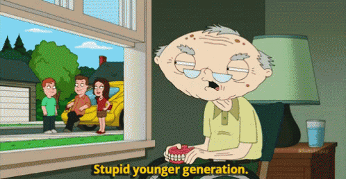

## **STARTING THE SCENARIO...**

When *Tarantino* makes his films, you might imagine that he starts with the most obvious choices: the **genre** of the film, the **plot** that will unfold, or the **scenes** that will surprise us. But among these big decisions, there's another, more subtle, but just as crucial: choosing the **characters' first names**. 

  

**Bill**, **Rick**, **Django**... how does he make his choice? Is it really a matter of chance, or does each name conceal a clue to the character's identity?  
Take the name *“Jacky”*: do you imagine a rebellious teenager, an adorable Canadian grandmother, or a *“badass”* woman? It's interesting to note that some first names make us think of certain **stereotypes** or specific **character traits**. But what do these names reveal about the characters themselves? In the universe of cinema, each first name can have a considerable impact on the way we perceive a character.  

If you watch a series of **romantic comedies**, you may well start to notice a number of recurring first names. What is hiding behind these repetitions? Are these first names simply **practical** or do they allow us to deduce the **personality** of the characters they refer to?

So, beyond first impressions, the association of first names with character traits may in fact be much more relevant than we think. Through a number of **qualitative** and **syntactic characteristics**, we aim to show that there is no such thing as chance when choosing a first name for a film in the cinema!  

If I told you that *Tarantino's* next character had **your first name**, what would its **attributes** be? It's up to you to find out.

---

**Preview**: 

Let's start with some **interesting facts** about the most common first names used in movies. First of all, let's take a look at the most common first names in our dataset:

  

    <iframe src="/assets/plots/1000_most_popular_female_names.html" class="iframe-plot"></iframe>
  

  

    <iframe src="/assets/plots/1000_most_popular_male_names.html" class="iframe-plot"></iframe>
  

**Johns** and **“Sarahs”** top the list. Can you think of an iconic film that features these two names? Here's a hint: **‘Hasta La Vista Baby’**... 

### AFFICHE "TERMINATOR"

While **John** and **Sarah** are by far the most popular, in more general terms we can see that *female first names* are more evenly distributed than those given to the *male characters*. Among the latter, **John** clearly stands out, being given more than twice as many times as **‘George’**, the second most common male first name.

---

Let's continue by analysing how the most common first names vary according to the **country of origin** of the films, in order to see whether these choices are influenced by different *cultures*.

    <iframe src="{{ site.baseurl }}/assets/plots/worldmap.html" width="100%" height="400" frameborder="0" style="border-radius: 10px; margin-top: 20px; box-shadow: 0px 8px 15px rgba(0, 0, 0, 0.1);"></iframe>

We can see here that in the **English-speaking industries**, the first name **‘John’** is most frequently attributed to male characters, while *female first names* show greater diversity. This confirms the observations made in the previous graphs: *female first names* tend to be more widely distributed than *male first names*, where **‘John’** stands out.

As far as **non-English-speaking countries** are concerned, we can see that the most common first names used by the characters are often of *local origin*.

Now that we've set the scene, let's take a closer look at the **links** between the characters' first names and their **attributes**.

## I. GENDER ANALYSIS

Naturally, in order to draw up a **profile** of a character from their name, it is essential to start by identifying their **gender**: *male* or *female*. At first sight, this may seem obvious. However, among the thousands of first names that exist, what is it that makes a first name perceived as *masculine* rather than *feminine*? 

With this in mind, we have undertaken an analysis of first names by looking at the notable differences in their composition between **feminine** and **masculine** first names. 

In the graph below, we compare the **first** and **last letters** of *female* first names with those of *male* first names.

    <iframe src="{{ site.baseurl }}/assets/plots/first_and_last_letter_by_gender.html" width="100%" height="800" frameborder="0" style="border-radius: 10px; margin-top: 20px; box-shadow: 0px 8px 15px rgba(0, 0, 0, 0.1);"></iframe>

Several significant **differences** emerge: *Female* names are much more likely to end with an **‘a’** or **‘e’** compared to *male* names. To further explore this observation, we conducted **chi-square tests** to compare the distributions of initial and final letters between *male* and *female* names. 

The results show that certain parameters, such as the presence of an **‘a’**, **‘d’**, **‘e’**, or **‘s’** at the end of a name, help distinguish **male** names from **female** names with a confidence level greater than **95%**. 

Additionally, by examining the common distribution, we find that nearly **15 times more female names** start and end with an **‘a’** compared to male names, which further reinforces the distinct patterns observed. 

*Perfect!* We now have a first clue to avoid imagining **John** as **Sarah** or **Sarah** as **John**… it’s a great start!

## II. AGE ANALYSIS

**Tastes** and **trends** evolve over the years: the names of your grandparents are likely very different from those of your younger cousins. What was original in the past is now considered **traditional**, and this evolution also influences the way characters are named in *cinema*.

  

But then, can we associate certain names with specific **age groups**? For example, do some names appear more frequently for an *elderly* person compared to a *newborn*?

    <iframe src="{{ site.baseurl }}/assets/plots/box_plot_age.html" width="100%" height="750" frameborder="0" style="border-radius: 10px; margin-top: 20px; box-shadow: 0px 8px 15px rgba(0, 0, 0, 0.1);"></iframe>

These graphs are not very **expressive**… this is probably not the right path to uncover the deepest **secrets** of *Tarantino*. However, we believe we have an **explanation** for this! 

The names of **older people** today are the names of **younger people** from the past. Taking this into account, it is normal not to find any significant difference between the names of characters from different **age groups**. 

## III. MOVIE GENRES ANALYSIS

IMAGE DE ROMEO ET JULIETTE (ROMEO) ET PERCIVAL

You've probably already noticed that certain **first names** seem to be associated with **stereotypes** and often appear in the same categories of films. For example, it's hard to imagine a character named **‘Romeo’** being anything other than romantic, passionate, and desperate for love. Similarly, it’s almost impossible to picture a **‘Percival’** as rude, mediocre, and unathletic. 

And it's no **coincidence**! These names are often used to embody specific **archetypes** in films. In fact, they frequently appear in the **‘Romance’** and **‘Action & Adventure’** genres, respectively. 

So, to better understand these connections, let’s explore the **correlations** between **first names** and **film categories**, starting by looking at the most common **first names** in each genre:

    <iframe src="{{ site.baseurl }}/assets/plots/top_10_names_by_movie_genre.html" width="100%" height="550" frameborder="0" style="border-radius: 10px; margin-top: 20px; box-shadow: 0px 8px 15px rgba(0, 0, 0, 0.1);"></iframe>

**Sarah** and **‘John’** continue to be omnipresent in all categories, but we can see that popular first names change according to **film genre**. 

---

Let’s analyze the **syntactic characteristics** of first names according to **film type**:

  

  

**Great results!** **Conclusive results!** 

This **heatmap** tells us a lot about the remarkable differences between the **syntaxes** of first names present in different **film genres**. Boxes marked with an asterisk show pairs of film types with statistically different **'length'** or **'VOWEL/CONSONANT ratio** distributions (with **95% confidence**) according to the **Tukey test**.

We can now find our way between **‘Terminator’** characters and **‘La La Land’** characters, *phewf*... We're beginning to know a lot about character names... but let’s not stop there — the most interesting is yet to come!

## IV. ORIGIN ANALYSIS - Another Title

Our dataset does not show the **ethnic origins** of the characters' first names. This is where the expertise of the **AdadaSurMonBidet** team comes in. We found an additional dataset (**Name Ethnicity Dataset** in the 'Resources' tab) that includes nearly **14,000 first names** with their ethnic origin. We developed a **predictive model** based on this additional dataset so that we could generalize it to our entire dataset.

**Impressive**, right? With an accuracy of **72%**, we were able to determine the ethnic origins of our characters' first names for further research. Our origin categories are:  
- **Slavic**  
- **Romance**  
- **East Asian**  
- **English-Speaking**  
- **Hispanic**

Films use **culturally specific** first names to reinforce the **authenticity** of their context. Stereotypes about certain populations are used in the choice of characters' first names to highlight certain character traits. Therefore, it is interesting to see if it is possible to make connections between first names and their **geographical origin**, in order to better imagine our famous **mysterious character** whose first name we only know.

We focused our analysis on the **lexical study** of first names according to their origin, as we believe this is the most **relevant** and **interesting** approach.

We began our study by examining the distributions of the **first** and **last letters** of the names. We conducted a statistical study using the **CHI-2 test** to determine the most significant elements. Here are the graphs we obtained, showing the distributions of origins for the most significant elements (i.e., those for which the distributions differ the most):

  

    <iframe src="/assets/plots/first_letter_by_origin.html" style="width: 100%; height: 500px; border: none;"></iframe>
  

  

    <iframe src="/assets/plots/last_letter_by_origin.html" style="width: 100%; height: 500px; border: none;"></iframe>
  

This graph clearly shows that the **first** and **last letters** of first names are very good indicators of the **origin** of a given name. Could we have guessed it? Who is the **Spanish character** between **“Pedro”** and **“Ivan”**? It’s intuitive, of course, but it’s always good to trust **good statistics**!

---

**Letters with accents** are called **diacritical letters**. This is a very interesting and effective way of determining the origin of a given name. We've selected the **4 most significant** ones to illustrate this:

    <iframe src="{{ site.baseurl }}/assets/plots/diacritic_origin.html" width="100%" height="400" frameborder="0" style="border-radius: 10px; margin-top: 20px; box-shadow: 0px 8px 15px rgba(0, 0, 0, 0.1);"></iframe>

This **bar plot** is very telling and shows that it is possible to isolate an **origin** thanks to the presence of certain **diacritical letters**.

---

Finally, it is also possible to use the **articulatory phonetics** of first names to determine their origin. We have chosen to focus on the most telling phonetics: **affricate**, **fricative**, **liquid**, **nasal**, and **occlusive**. We therefore studied the **percentage** of first names, for each origin, that contain each of these **phonetic categories**.

    <iframe src="{{ site.baseurl }}/assets/plots/phonetics_by_origin.html" width="100%" height="400" frameborder="0" style="border-radius: 10px; margin-top: 20px; box-shadow: 0px 8px 15px rgba(0, 0, 0, 0.1);"></iframe>

This analysis is useful, but we expected it to be more **telling**. We observe that names of **Hispanic** and **Romance** origin contain more **liquid consonants** (such as [l] and [r]), while **Slavic** and **English** names show a greater presence of **plosives** (such as [p] and [t]). **Nasals** (such as [m] and [n]) are particularly frequent in **Slavic** and **Hispanic** names, but less so in **Asian** names. On the whole, the phonetic structures of names reflect the specific features of each **origin**.

We now know how to recognize a character's **origin** from his or her **first name**. Now we want to know if it's a **nice character** we're going to get attached to, or a **disgusting one** who's going to disgust us.

## V. SENTIMENTAL ANALYSIS

Which of these two names, **“Toby”** and **“Lucifer”**, would you give to a great villain? Which would you give to a **sympathetic** and **generous** character? I think we agree...

We've all been conditioned to think of some names as synonymous with **kindness** and **trust**, while others symbolize **wickedness** and **terror**. Let's continue our study to find out if there's a **significant difference** between the names of **nice characters** and the names of **nasty characters**.

### **Sentimental Analysis**

Our main dataset does not include information on character **morality**. However, we do have access to all the **movie summaries** in our dataset. We therefore came up with the idea of establishing our characters' **values** ourselves, so that we could study the link between these and their **first names**. 

To achieve this, we carried out a **sentimental analysis** for each first name in our dataset, based on the movie summaries. We began by grouping all the sentences in the summaries according to the **first name** of the character they refer to. From there, we performed sentimental analysis on each first name, enabling us to assess the tendency of certain first names to designate **good guys** or **bad guys**. 

Our sentimental analysis enabled us to classify the first names into **5 different categories**:
**Extraordinary**, we can finally put labels on our first names: **“Very Good Guy”**, **“Good Guy”**, **“Neutral”**, **“Bad Guy”** or **“Very Bad Guy”**. 

So what are the names of the greatest **villains** and those of the most **lovable characters**? Let's take a look:

  <button class="tab-button active" data-target="plot-men">Femmes</button>
  <button class="tab-button" data-target="plot-women">Hommes</button>

  

    <iframe src="{{ site.baseurl }}/assets/plots/sunburst_good_bad_girls.html" class="iframe-plot"></iframe>
  

  

    <iframe src="{{ site.baseurl }}/assets/plots/sunburst_good_bad_guy.html" class="iframe-plot"></iframe>
  

Now that we've familiarized ourselves with **sentimental analysis**, let's see if we can find some interesting **motifs**. 

If you're a fan of **American espionage blockbusters**, you've probably noticed that the villains' names are, in most cases, not English-speaking... But can we say the same in the opposite direction? The idea immediately came to us to compare the presence of **Russian first names** for **American film villains** during the **Cold War**, and vice versa.

### USA/URSS

We might wonder if we can identify broader historical or political trends through morality, character origin, and the country of film production.

    <iframe src="{{ site.baseurl }}/assets/plots/us-urss.html" width="100%" height="400" frameborder="0" style="border-radius: 10px; margin-top: 20px; box-shadow: 0px 8px 15px rgba(0, 0, 0, 0.1);"></iframe>

Well, the results aren't what we'd hoped for, but are they really that **bad**? 

We can see that the **villains** are mostly from the country in question. That makes sense! **Films** often tell an internal story in their **country of production**, so it's only natural that the **villains** (but also the **good guys**) should come from that country. 

However, the question remains: are there really more **villains of Slavic origin** in **Russian films** and of **English origin** in **American films**, or is this simply the effect of being the **majority group**? Let's dig deeper.

    <iframe src="{{ site.baseurl }}/assets/plots/proportion_us.html" width="100%" height="400" frameborder="0" style="border-radius: 10px; margin-top: 20px; box-shadow: 0px 8px 15px rgba(0, 0, 0, 0.1);"></iframe>

**Ah-ha!** The high proportion of **English villains** in **American films** was only due to the large number of **English names**. This graph shows more clearly the proportion of **villains**, **neutrals**, and **good guys** for each **ethnic group**. All ethnic groups have more or less the same distribution, with more **good characters** than **bad**. **Phew**, we're saved, the **good guys** are in the majority! Unfortunately, we don't have enough data for **Russian films** to be able to give us **usable results**.

So **Russians** aren't the **bad guys** in **American films**? According to our data, no, not especially. Out of curiosity, let's take a look at **American films** released during the **Cold War** to see if a trend emerges.

    <iframe src="{{ site.baseurl }}/assets/plots/cold_war.html" width="100%" height="400" frameborder="0" style="border-radius: 10px; margin-top: 20px; box-shadow: 0px 8px 15px rgba(0, 0, 0, 0.1);"></iframe>

The results aren't very **exciting**... The same graph is found as for all films. Our hypothesis that **Russian names** are predominantly the names of **villains** in **American films** is not confirmed. 

One hypothesis to explain this lack of evidence is that the **dataset on movies** was compiled by **Americans**, which may introduce a **Western-centric bias**. This bias could mean that even the **Russian movies** included in the dataset are those that are more **Westernized**, potentially leading to an overrepresentation of **English-speaking ethnicities** as the dominant group, even in **Russian films**. 

Additionally, this bias is evident in the **underrepresentation** of **Russian movies**, among others, in the dataset, as reflected in the disproportionate number of films produced per country.

We examined American films released during the Cold War to see if a trend in the origins emerge. This naturally leads us to a broader question: how have the origins of characters in American movies evolved over the years? By observing trends across decades, particularly during politically charged periods like the Cold War, we can investigate whether certain ethnicities were more prominently featured as heroes or villains. The following graph explores these trends, providing a deeper look at the representation of different origins in American cinema over time.

    <iframe src="{{ site.baseurl }}/assets/plots/ethnicity_over_time.html" width="100%" height="400" frameborder="0" style="border-radius: 10px; margin-top: 20px; box-shadow: 0px 8px 15px rgba(0, 0, 0, 0.1);"></iframe>

Excellent ! We can deduct some useful information from this graph, let’s break it down. This plot shows a global increase in the number of characters over time. This rise can be attributed to two factors: firstly, an increase in the number of movies produced in the USA, and secondly, the underrepresentation of older movies in the dataset. A noticeable dip in the total number of characters occurs in 2010, which reflects a gap in the collection of movies from that period. What stands out is the growth of non-English origins over time. This trend suggests that from the 1980s onward, there was a movement towards greater diversity in character names within the American film industry. In particular, the prevalence of Romance and Slavic-origin names surged, and by 2005, nearly half of the characters' origins were non-English.

## Conclusion

**Congratulations**, you’ve reached the end of our **data-driven guide** to discovering **character features** based on names! We took you on a journey through the hidden power of **linguistics**, **phonetics**, and the broader world of **words**, and we hope you’ve learned something **fascinating** along the way.

While our exploration revealed some intriguing insights, it’s important to recognize the **limitations** of our approach. One potential weakness lies in our **predictive models** for **sentiment analysis** and **ethnicity**. These models, despite their potential, may not fully capture the richness or nuance of the datasets they were trained on, which can sometimes lead to **oversimplified** or **inaccurate interpretations**. Additionally, the **movie dataset** itself comes with its own **biases**. As with any human-generated content, it reflects the inherent biases of its creators and could influence the conclusions drawn about the movie industry.

Despite these challenges, the possibilities are **exciting**. Imagine knowing the **personality traits** and **attributes** of a movie character simply from their name before you’ve even seen the movie. It’s a tantalizing prospect, isn’t it?

Of course, it seems difficult to manually analyze **character features** — and you probably wouldn’t want to count **diacritics** or analyze **n-grams** every time you encounter a new character name.

That’s where we come in! We’ve built a **model** to handle the **heavy lifting** for you. Just think of a name, and our model will reveal the likely features of that character based on the patterns we’ve uncovered. **ADA magic** to bring characters to life in ways you’ve never imagined!

## Name Predictor



### Data Insights
In order to see all the attributes we have analysed and their distribution, take a look at the ‘Our Dataset’ tab, where you will find a detailed overview of our data.
